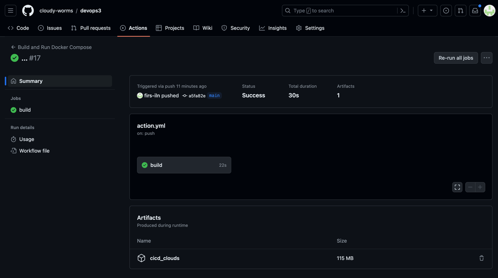

# devops3
CI/CD demo

Создадим Workflow, который будет собирать образ и загружать его в Artifacts после каждого пуша

```yaml
name: Build and Run Docker Compose

on:
  push:
    branches:
      - main

jobs:
  build:
    runs-on: ubuntu-latest

    steps:
    - name: Checkout repository
      uses: actions/checkout@v3

    - name: Build Docker Compose
      run: docker-compose build

    - name: Save Docker Image
      run: |
        docker save -o cicd_clouds.tar devops3_clouds

    - name: Upload Docker Image Artifact
      uses: actions/upload-artifact@v3
      with:
        name: cicd_clouds
        path: cicd_clouds.tar

```

### Результат:
